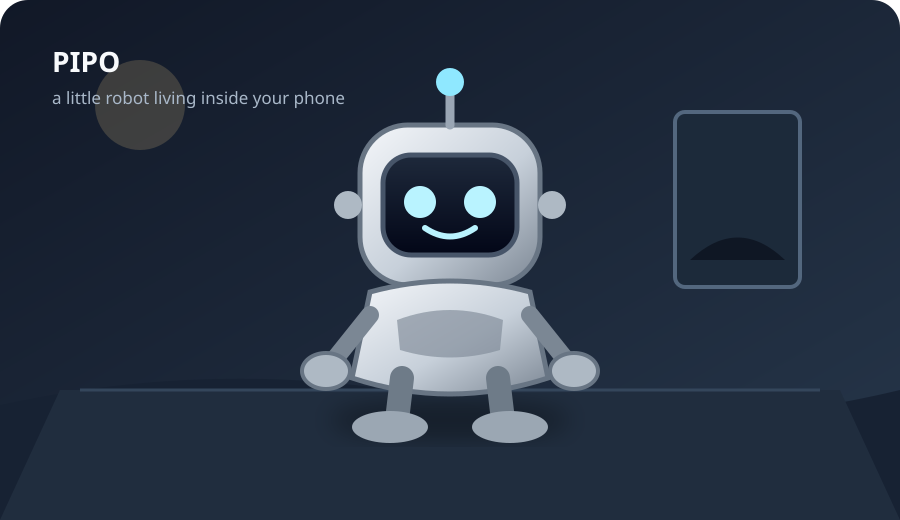

# Pipo 🤖

<p align="center">
  
</p>

<p align="center">
  <strong>A little robot living inside your phone.</strong><br/>
  Character-first Android simulation · procedural 2.5D · autonomous life · local-first
</p>

<p align="center">
  <a href="DEVICE_TEST_REPORT.md"></a>
  
  
  
</p>

> **“I wonder what Pipo is doing.”**

> A tiny robot who lives inside your phone.

Pipo is a character-first Android app about a small, curious, slightly mischievous robot. He has his own moods, memories, habits, projects and opinions, and he lives in a little room inside your phone.

The whole product fits in one sentence:

> "I wonder what Pipo is doing."

Open the app and you find out. He might be asleep with one eye open (pretending), lying on the floor staring at the ceiling, halfway through a project that keeps catching fire, chasing a moth around the desk lamp, or peeking in from the edge of the screen because he heard you come back.

Or he might not be there at all. There's a note on the door: he went to the hardware shop because the flying machine needs a motor. Nib, his small beeping robot pet, stayed home and is asleep in the cardboard box. Twenty minutes later the door opens and he walks in with a bag, and a magnet he bought instead of the wire he went for.

His life runs on your device. There's no account and no analytics: it's a robot and a JSON file. What does go online is listed plainly under [Privacy](#-privacy): his AI voice (chat, "look", "find out"), your city's weather, and the searches you ask for. All of it can be switched off in Settings.

---

## What is Pipo?

**Pipo is not an assistant.** He isn't a productivity app, a chatbot in a robot costume, or a dashboard. Nobody asks Pipo for a to-do list. He's the one with things to do.

He's a simulated character with persistent state that keeps evolving:

- **A body in a room.** He walks, runs, sneaks, sits, lies down, gets up, falls over, spins, dances, turns his back on you when he sulks, and stands at the window watching birds.
- **A mind with opinions.** Traits, mood, memories and unfinished projects decide what he does next, what he says and how he says it.
- **A life that goes on without you.** Nothing runs in the background, but when the app reopens (or the hourly worker fires), the time you were away is replayed through the same behavior engine. When you come back, something has changed, and he'll tell you about it.
- **A relationship, not a service.** It grows slowly with shared time and never shrinks because you were away. There's no score on screen. You notice it in how he acts.

There's no objective, no streak to protect and no score for the user. The reward is watching him.

---

## 🪞 The mirror-world, Bolt and neighbours update

The newest round, played on a Galaxy S23 (✅ = seen working on the phone):

- **Real conversations out in the world** (`engine/Talks.kt`). When you peek at him, Pipo talks with whoever is there. Each neighbour has their own voice: Grumble at the hardware shop is grumpy, Juniper is all blinking lights, Coach Raj is at the cricket ground, Lin plays table tennis and Bea plays badminton. They talk about what he came for (the part and the project it's for), the match, the weather and how often he's been. Nib chips in. A bubble shows over whoever is speaking, the transcript builds up underneath, and he brings a line of it home in his story. ✅
- **New sports places:** a cricket ground (pitch, boundary rope, sight-screen), Riverside Sports Hall (table tennis) and a badminton court, each with its own neighbour. While he's out playing, a **"Watch the match"** button on the home screen opens the live view. ✅
- **Cricket, two innings.** You bat first and tap when the ball reaches you. Mistimed swings show "too early" or "too late", and the stumps fly when you're bowled. Then the view flips: Pipo bats, and you bowl by tapping when the sweeping arrow lines up with his stumps. ✅
- **The hallway mirror.** A tall mirror by the front door shows his reflection. He checks himself before going out, and you can tap it. Once the mystery has started, the glass shimmers cyan, and sometimes his reflection stays behind and waves on its own. ✅ (reflection and tap)
- **Nib doesn't trust the mirror.** Nib goes and growls at it, then runs to tell Pipo in its own words ("Pipo, listen! Other Pipo in mirror. Same face. Different."). Pipo goes to check. ✅
- **Nib is its own character.** Text Nib directly ("nib, ...") and it answers in its own small voice and short words. It isn't Pipo's assistant, except in the lab. ✅ **Pipo answers Nib** when Nib says something. ✅
- **Bolt, his J.A.R.V.I.S.** "Hey Bolt" talks to his desk helper. If Bolt isn't built yet, he offers to build it, then really goes out for the missing parts (a little light from Juniper, wire from Grumble). ✅
- **Suit Mk 0:** before he can build real armour, "suit up" gets him a cardboard suit with tape, marker eyes and a drawn-on core. ✅
- **Movie nights:** popcorn, the rug, Nib, and a film on the TV (space, dinosaurs, scary, nature or cartoon), with reactions and a review afterwards. ✅
- **"Pipo, come back"** brings him home within seconds, wherever he is. ✅
- **The map** shows places he hasn't been yet as dashed "?" circles, with fog over the edge of the world. ✅

---

## 🆕 The living-world update

What changed in this round, with what was verified on a real phone (Galaxy S23) marked ✅:

**He knows his own life.** Pipo's answers come from his real memories, journal, possessions and Nib, through a grounding layer (`engine/Grounding.kt`). "What did we do yesterday?" gets the actual day. Ask "who is Nib?", "what's on your shelf?", "remember the rubber duck?" and he answers with what's true. ✅ He tries to do what you ask: asking him out, to cook or to play isn't refused because of his own internal cooldowns. If the shops are shut he says so ("Mo's Bakery is closed now. It opens at 6"). ✅

**Nib is a character** (`engine/NibLife.kt`, `ui/render/PetPainter.kt`, menu → **Nib**):
- **Feelings:** eight eye expressions, five sounds (happy trill, grumpy buzz, curious boop, sad slide, smug double-chirp) and picture thought-bubbles (ball, Pipo, battery, food, heart, "!", "?", music). ✅
- **Getting under Pipo's feet:** Nib pesters him while he's busy and he grumbles theatrically before giving in. ✅ Nib begs while he eats ✅, waits for the first bite when he cooks, curls up at bedtime, waits by the door when he goes out, and gets jealous when you pat him.
- **Growing up together:** friendship stages (shy newcomer → family), six tricks Pipo teaches over many sessions (high-five, fetch, spin, dance, play dead, sing), a favourite nap spot, presents, sulking when ignored, and getting braver in storms.

**Sports, as two-player games with Nib.** Football, cricket, table tennis and badminton at the field, park and garden, always Pipo vs Nib with a real score (Nib can win). There's indoor cricket with Nib bowling along the floor ✅, and the ball is physically at his feet, never teleported ✅. You can also play **Cricket** and **Table Tennis** against Pipo yourself. ✅

**Pipo the inventor** (`engine/Inventor.kt`):
- **Builder levels** (Tinkerer → Genius) that grow from every build and failure. ✅
- **Harder blueprints with real effects:**
  - Nib's turbo wheel and light-up tail
  - Bolt, his desk helper
  - a scout drone that brings home photos
  - rocket boots
  - the **armor**, Mk I → Mk II (flies) → Mk III (glowing core, flip-up visor)
- "Suit up" ✅ and "suit up and fly" ✅. The workshop turns into a lab as he levels up (tools, blueprints ✅, a hologram, holo-screens).

**The world is yours:**
- **Real weather** for your city from Open-Meteo (✅ Kochi, rain, 26.9 °C), with seasons (monsoon included) in the window tree.
- **Festivals:** Christmas, Halloween, New Year, Diwali, Onam, Vishu, Pongal, Holi and Eid. Each one decorates the room and the garden, gives Pipo and Nib outfits, and has a greeting; on the other side of the mirror they celebrate "wrongly". The moving dates for 2026–28 come from a table and need checking.
- **Outside places** are painted scenes (park, garden, field, lake, hills, shopfronts) where he actually does the thing he went for, with Nib.
- **The wall** keeps a pennant for every place he's been, plus a calendar.

**"Pipo, look!"** He asks first, then your own camera app takes one photo. A vision model sees it and he reacts as a curious kid. He never identifies people, guesses names or comments on looks. The photo is deleted right away, and what he sees feeds his world (a ball starts a game, food gives him a craving). ✅ up to the camera opening.

**Your phone:**
- **Music and video:** "play X" plays the top YouTube result ✅. "search X on YouTube" ✅ and "google X" show results.
- **Other AIs:** "ask ChatGPT X" sends your question to ChatGPT in the browser ✅, and "ask Gemini X" uses Google AI Mode ✅.
- **Finding out:** "find out X" makes him look it up and tell you which AI answered ✅.
- **Voice chat** continues hands-free after he answers. Not yet tested with a real voice.

**Fixes found by living with him on the phone:**
- Flappy Pipo's and Pixel Shooter's scores never updated.
- "play football" opened YouTube.
- He never scrolled his phone or played his console: his choice only ever looked at his top 3 ideas.
- He charged on loop while your phone was plugged in.
- The keyboard covered the room after you sent a message.
- He talked about his book after putting it away.
- Two footballs could exist at once.
- After 9 pm, "let's cook" sent him to look at bugs.

## ✨ A Living Little Character

### Personality
**Ten traits** are rolled at first run, so no two Pipos are identical: curiosity, playfulness, mischief, affection, confidence, sociability, patience, laziness, adventurousness and stubbornness. They drift in tiny, bounded steps based on what he actually does. "Shy" isn't stored anywhere. It emerges from low sociability plus low confidence.

### Moods
**Twelve moods** (happy, excited, curious, sleepy, bored, grumpy, lonely, nervous, proud, embarrassed, mischievous, relaxed) are derived from continuous vectors: energy, boredom, loneliness, irritation, excitement, curiosity, happiness and affection. Short-lived **transient moods** override the derived one: proud after finishing something, embarrassed after a failure, nervous when picked up.

Mood isn't decoration. It changes which activities he considers, his idle body language, his face, the color of his glow, his voice's pitch, rate and volume, and the tone of any notification.

### Emotional body language
Each mood has its own physical signature, and transitions are blended rather than snapped:

| Mood | What his body does |
| --- | --- |
| Happy | Bouncy sway, antenna wiggles, hums (a "hum-sway" fidget) |
| Excited | Hopping, arms up, fast antenna |
| Sleepy | Slow, drooping head, heavy eyelids, yawns (with a yawn sound) |
| Curious | Leans forward, head tilt, dilated pupils |
| Embarrassed | Turns away, hands over his face, blush |
| Grumpy | Arms crossed, half-turned away, impatient foot tap |
| Proud | Upright, chest out, smug squint |
| Nervous | Small trembling, darting eyes, shrunken pupils |
| Mischievous | Crouched, side glances at you, suspicious squint, sneaking |
| Lonely / sad | Deflated posture, drooping antenna, a single glinting tear |

### Autonomy
He decides for himself what to do next. Nothing runs on a script loop. See [Autonomous life](#autonomous-life).

### Curiosity and mischief
He discovers things, investigates them, builds with them, and occasionally does small crimes against the room. See [Discovery & Projects](#-discovery--projects) and [Mischief](#mischief).

---

## 🌍 Beyond the room (schema 2)

The room is still the heart of it, but it's no longer the whole world. Every system below is owned by the deterministic engine (`engine/`), persisted in the save file, and feeds the others. The AI never creates any of it.

**Where is he?**
- **He goes out** (`engine/Trips.kt`). A trip always has a reason he can state, such as *"The flying machine needs a motor"*, *"It's raining. That means soup. That's the rule."*, *"My coin jar is looking sad. Fennel needs a helper."* or *"The frogs at the lake have opinions."* He walks to the new front door and leaves. The room stays behind: a note on the door, Nib (unless Nib went too), and whatever he left lying around. In-app trips take a minute or two; offline trips take real time (travel there and back, plus the visit).
- Places are gated by opening hours, the time of day and **his weather**: no trips at night or in storms, and rain keeps him in until he owns an umbrella (which he tends to buy after getting soaked once).
- **You can text him** while he's out: the chat becomes his little phone. *"where are you?"* gets an answer from wherever the engine says he is. *"come home"* really brings him home sooner.
- **The present moment:** catch-up doesn't just replay the past. It also decides what he started a few minutes ago and hasn't finished, which is how the room can be empty when you open the app. In a simulated three weeks he was out about 6–8% of waking hours.
- **Hiding:** sometimes he hides behind the arcade cabinet (only his antenna tip shows), inside his cardboard box (eyes over the edge) or under the blanket (a lump that giggles). The camera doesn't give him away. You find him by tapping him or his hiding place; if you don't, he gives up and pops out. Sometimes he hides because he did something embarrassing.
- **Falling asleep in odd places:** very tired and far from his bed, he sleeps where he is: on the rug, sitting by the desk, in the box.
- **The camera isn't a leash.** When he isn't coming over to you, it stays where you left it for a few seconds before it drifts to him. You look around the room first.

**Nib** (`engine/PetEngine.kt`, `ui/render/PetPainter.kt`): a small, round, amber robot with one big eye and a springy tail. Nib has traits, moods, energy, a bond with Pipo and a little memory. It follows him, naps in the box or on the rug, plays with the ball, steals shiny things and hides them under the bed (a glint you can spot; Pipo eventually finds them), knocks things off the shelf, hides from thunder, greets you when you arrive, and comes along on some trips (where it gets lost in aisle two). Nib sometimes stares at the window at night, and Pipo looks and sees nothing. A Pipo from before this upgrade meets Nib as part of his story: it follows him home.

**The world:** 13 places (garden, park, football field, hardware shop, electronics shop, market, bakery, café, second-hand shop, repair shop, library, lake, hills) plus two that aren't on the map until he finds them. There are nine neighbours with names and a little memory of him (Grumble, Juniper, Mrs. Pim, Mo, Ada, Old Rook, Fennel, Tess, Kip), and nine kinds of animals whose individuals keep turning up. On the second meeting he **names them** ("Sir Flap", "Pebble").

**The map** (menu → Map) is his record: only places he's been, with his own notes (*"good food"*, *"Nib got lost here"*, *"???"*). If he's out you see where. Tap it to **peek**: a small painted scene of the place, lit by the real time and his weather, with him in it doing what he went there to do.

**Weather** (`engine/WeatherEngine.kt`, `data/RealWeather.kt`): clear, cloudy, rain, wind, fog and storm. It's **your real weather** (approximate city from your network, conditions from Open-Meteo, refreshed every 30 minutes) when that's on and online. Otherwise it's his own deterministic climate from his seed and the clock. It shows in the window (drops racing down the glass, fog, clouds, a tree bending in the wind, lightning) and in the room's light. It changes what he does: rain means the window, a book and the sketchbook, storms mean staying close to Nib and asking to sit near you, and a clear morning pulls him outside.

**Money** is small and believable: a coin jar you can see on his desk, odd jobs at Fennel's, and selling spare finds to Old Rook. There's no store and nothing to buy for real money. If he can't afford a part, he goes to work for it or saves up, and says so.

**Food** (`engine/Life.kt`): a pantry you can see on the kitchen shelf, cravings with causes (weather, a video, a favourite), and eating because he wanted noodles, not because a meter hit 83. He can cook six recipes from ingredients. They can come out great, burnt (smoke under the ceiling, eaten anyway, out of respect) or weird ("It's purple now"). He learns what he likes by eating it; every Pipo's tastes are different.

**Projects that need shopping:** four new projects (a flying machine, a ball kicker, a bird feeder, a telescope) need bought parts. The loop is idea → missing part → trip (or a job to afford it) → bag → workbench → build → success, failure or evolution → an artifact on the shelf. A finished bird feeder brings more birds to the window; a telescope stands by it.

**Things he makes:** drawings (of you, Nib, himself, the sparrow he named, the lake, his inventions, a dream) hang on his walls. Photos from his phone (animals at the window, places, Nib moving, selfies) are pinned to a new corkboard. Both are kept forever in *Pipo's things*.

**His feed:** reels on his little phone now have content (robots, pets, football, inventions, cooking, wildlife, comedy, music). He reacts to them, gets into topics, and an obsession leaks into life: he cooks the dish, practises the trick, builds the machine. It's still capped screen time.

**Football:** kick-ups in his room with the ball bouncing off his feet, counted and remembered as personal bests (*"NEW RECORD. 14."*). Longest shots are recorded at the field. After football, the ball is left by the door.

**Evidence** (the room tells stories): a plate on the counter, the shopping bag by the door, the box he kept, the ball by the door, a burnt-smell cloud, something Nib knocked onto the floor, Nib asleep in his bed, a library book on the desk, the coin jar filling or emptying, new drawings and photos, new things on the shelf. He tidies up eventually (`CLEAN`).

**Something behind the world** (`engine/Mystery.kt`): a slow, original thread with no quest markers and no popups. Nothing happens in the first week, and each step needs 8+ days since the last *and* an ordinary moment to happen in: a night at the window, a dream he draws, a visit to Old Rook's, a photo he looks at again, a walk to the hills, a token that fits a door. Nib notices first. At night his reflection in the window glass sometimes waves when he doesn't. Beyond it there are notes, in his handwriting, from a Pipo whose life went differently (*"We don't have a Nib here. I have a moth. His name is Lamp."*). Each step is a quiet moment and a journal entry.

**Sound:** a real **hum** (a short original pentatonic tune in a warm, closed-mouth timbre, legato with vibrato) when he's content, cooking, drawing or dancing to the music in his head. Sighs and yawns are breathy now, and there are new sounds: chewing, the kick of the ball, the door, Nib's chirps, the camera shutter, the sizzle of the pan, pencil scribbles and distant thunder. Everything is synthesized; there are still no audio files.

## ✏️ 2D polish (no 3D)

The procedural 2D/2.5D renderer is the final visual direction. The polish pass:
- **Face:** a new feeling reaches his eyes first and his mouth a moment later. Humming shows a closed-mouth "mm" with a gentle sway, synced to the sound.
- **Micro-moments** chosen by mood: a sly glance at you (mischievous), a chest lift (proud), a puzzled head tilt with a double blink (curious), eyes sliding away (embarrassed), a little balance wobble.
- **Movement:** he looks where he's going and dips before setting off, speeds up over a few steps, eases into stops, and settles when he gets there. Sitting compresses his body a little.
- **Touch:** poking his head boings his antenna, his feet are ticklish, and he looks at your finger. When you tap an object, he looks at it before he answers.
- **Nib:** carries what it steals in its mouth all the way to the bed, squashes when it stops, bounces when excited, breathes slowly when asleep, and keeps an eye on Pipo.
- **Room:** a soft edge line on his shell, morning, sunset and rain colour grading, curtains that sway in the wind, a fridge that opens with its light on, a box that wobbles when he hides in it, and a corkboard with overlapping, taped photos and a sticky note.
- **His phone** shows the app he's actually using: viewfinder, gallery, weather, typing notes, recorder waveform, calculator, map.
- **Journal:** looks like his notebook, with paper, ruled lines, handwriting, margin doodles, and the odd crossed-out word in his own notes.
- **Map:** handwritten names and notes, a doodle for each place, the animals he met there, and today's weather.
- **Peek scenes:** hazy far hills, a town skyline, each shop's window showing what it sells, and a contact shadow under him.
- **Games:** Memory cards flip, the winning Tic-Tac-Toe line glows, Rock Paper Scissors hands pop when revealed, Pixel Shooter moths burst, and the Flappy Pipo score pops.
- **Calmer camera** also dims lightning flashes and turns off in-game hit flashes.

## 🌎 Pipo's World

### The room
A side-scrolling room about 2.4 screens wide that you can pan by dragging. It contains his **bed** (with blanket), a **plant**, a **charging station** that shows your phone's real battery, a **window** onto the outside, a **desk** with a computer and lamp, a **shelf** for his discoveries, a **pegboard and workbench**, an **arcade cabinet**, a **TV and game console** on a low stand under the window, a **toy box** and ball, a **real-time clock**, string lights under the ceiling, and the **drawings** he makes of you, which hang above his bed. Pipo also owns a **tiny phone** that he pulls out now and then.

### Interactive objects
Tap an object and he might go and use it (or refuse, depending on how stubborn or grumpy he is). He remembers what you encourage. If you keep suggesting the plant, visiting the plant becomes a habit.

### Day and night
Lighting follows the real clock. Morning light gives way to an orange evening sky and then a starry night with a moon. At night the desk lamp throws a warm cone and a pool of light, the monitor and arcade glow, and the whole room dims.

### Environmental life
- A **sunbeam** comes through the window with drifting **dust motes**. Its angle follows the actual hour.
- A **moth** circles the desk lamp at night. A **bird** crosses the window during the day.
- The **plant rustles** when Pipo brushes past it and sways to music.
- The **charging station** pulses and sends up energy motes while your phone charges.
- **Welding sparks** fly at the workbench while he builds, and the **monitor** shows scrolling text, or a music visualizer when music plays.
- The curtains breathe, the clock tells the real time, and faint dust drifts through the air.

These aren't only backdrop. His attention system looks at the same moth, bird and ball the renderer draws.

---

## 🎨 Rendering: Procedural 2.5D rendering

Pipo is **not** a 3D model. There is:

- **no OpenGL** (or Vulkan, Filament, SceneView…),
- **no external 3D model** or mesh,
- **no 3D asset pipeline**, no sprite sheets and no bitmaps,
- **no rendering dependency** beyond Jetpack Compose itself.

Everything is drawn procedurally in code on a Jetpack Compose `Canvas`: procedural geometry with depth coordinates, projection through a yaw rotation, depth-aware draw ordering, procedural lighting, shadows, reflections, a perspective floor and parallax layers. What makes it feel physical is this custom **2.5D projection and lighting layer**:

**Character rendering (`ui/render/PipoPainter.kt`)**
- Every body part (head, face screen, ear pods, torso, arms, legs, feet, antenna) has a position in a small **local 3D space**: x across his body, z toward the viewer.
- Parts are **projected through his current yaw** (rotation around his vertical axis) and **depth-sorted**, so the far ear, arm and leg are drawn behind his body and shaded darker.
- He can turn through a **front → three-quarter → profile → back** view. The face screen foreshortens and slides around the head, a side panel of the head appears, and from behind you see his back vents and battery hatch. When he sulks, he really does turn his back on you.
- The **head has its own yaw**, so his head leads his body when he looks at something.
- Spinning is a real rotation through these views, not a horizontal squash.

**Lighting and shading**
- Each shell part gets a **key-light/shade gradient**, a top sheen, a **rim light** on the opposite edge, and a **specular glint** on the lit side.
- The light isn't fixed. `pipoLight()` works out which of the room's **real light sources** is lighting him: the window by day (warm orange in the evening), the desk lamp at night, the charger's cyan glow while charging, the monitor and the arcade. His highlights switch sides as he walks past the lamp, and the second-strongest source becomes his rim light. Turn on the flashlight and he's lit from his own antenna.
- **Contact shadow:** soft, dark and tight at his feet, wider and fainter when he jumps or is carried, and stretched away from the light (long shadows under the lamp at night). There's also ambient occlusion under his feet and a shadow from his head onto his body.
- His **face screen** has a glass reflection band, a bezel highlight and eye-glow bloom. The pupils are brighter cores inside each eye that travel further than the eye outline, which reads as looking.

**Environment depth (`ui/render/RoomPainter.kt`)**
- **Perspective floor:** board seams converge on a vanishing point at the center of the screen.
- **Parallax layers:** the view out of the window (hills, sun, moon, clouds, stars, birds) moves slower than the room, and a **foreground layer** (his charging cable on the floor) moves faster than the room.
- **Phone-tilt parallax:** the accelerometer (already used for shake detection) shifts the far and foreground layers, so tilting the phone gives a little depth.
- **Contact shadows under all furniture**, ambient occlusion where the wall meets the floor, gradient-shaded wood, a lit plant pot and leaves, and a shaded arcade cabinet with scanlines.
- **Light volumes:** the sun or moon shaft through the window, the lamp cone, and additive glows blended with `BlendMode.Screen`.

**Camera**
- It follows Pipo smoothly across the room, and you can drag to pan (it holds your framing for a few seconds). Panning tracks your finger exactly, even while zoomed.
- It **dollies in** a little (up to about 1.12×) when he talks to you, presents a discovery or listens to you. It also creeps in slightly when he's asleep at night. Touch input is converted back through the same zoom transform, so poking still hits the right spot (verified on a phone, see the device report).
- While you **carry** him the camera holds still so he stays under your finger, and it only scrolls (taking him along) when you drag him to the screen edge.
- **Screen fit:** the world scale is `min(width / 88, height / 185)`, so tall 19.5:9 phones show a slightly narrower slice of the room at a bigger scale instead of a band of empty floor.

**Performance notes:** colour blending in the painters uses a small packed-sRGB `lerp` (`ColorMath.kt`) instead of Compose's Oklab `lerp`, which was one of the hottest paths on a real phone. See `DEVICE_TEST_REPORT.md` for measured numbers.

### Animation system (`ui/render/Rig.kt`)

| Layer | What's implemented |
| --- | --- |
| **Idle** | Breathing, blinking (single and double, slower when tired), autonomous saccades plus tiny micro-saccades, and **fidgets** layered on calm poses: looking around, glancing at you, shifting weight, antenna twitch, looking at his hand, scratching his head, foot tapping, hum-swaying, sighing, yawning, small hops. Which fidgets he picks depends on mood and energy. |
| **Locomotion** | Walk, run, **sneak** (tiptoe burglar walk), hop, spin, sit, **lie down**, **get up**, fall, recover, dance, being carried. A **spring-driven yaw** turns him toward where he's walking and overshoots slightly on turns and stops. Running stops end in a skid squash. |
| **Secondary motion** | The antenna is a **damped spring** pushed by his body's acceleration, so it lags, wobbles after stops and whips on landings. **Landing impacts** squash and stretch him (hops, drops, skids). |
| **Facial** | 21 expressions interpolated parameter by parameter: eye open, scale, eyelid height and angle, happy arcs, closed, round (surprised), asymmetry, blush, sparkle, squint, **wink**, **dizzy spirals**, **tear**, **pupil dilation**, and mouth curve, open, width, skew and wave. |
| **Emotional** | Per-mood idle poses (see the table above), plus poses for arms crossed, turn away, sulk, laugh, sigh, yawn, dizzy, celebrate and "finger up (one sec)". |
| **Speech** | The mouth is driven by **the actual letters being said**: open on vowels, closed on m, b and p, pauses on punctuation, and bigger on ALL-CAPS words, which also brighten his eyes and bob his head. The speed follows the voice's speech rate for his current mood. Line style changes his body: a question tilts his head at the end, a whisper makes him lean in, excitement makes him bounce, a laugh brings a laughing face and bounce, and a sigh deflates him. |
| **Gaze / attention** | When nothing directs his eyes, an attention system picks what to look at: **you** (more often the closer you two are), the moving ball, the moth, a bird at the window, whatever he's working on (almost nothing else while he's absorbed), or the charger. Big gaze shifts come with a blink. He looks at where you touch, looks where he's going, and **notices you when you open the app**. |
| **Environmental** | The plant reacts to him, the ball rolls, and the lamp, monitor, arcade, charger and workbench animate based on what he's doing. |

---

## Autonomous life

`BehaviorEngine` scores 20+ activities as a function of **traits × mood × environment × his own recent life**, then picks with controlled randomness among **everything within reach of his best idea**, with a small pull toward things he hasn't done lately. A test simulates whole days and requires real variety: 14+ kinds of activity, phone and console included, and nothing over 30% of his day.

> sleep · rest · charge · explore · play with the ball · arcade · experiment · build · examine his collection · rearrange (mischief) · read · think at the window · computer · check on the plant · dance · prepare a surprise · come find you · scroll reels on his phone · play his console · **do absolutely nothing**

**His gadgets are a treat, not his life (`ScreenTime`).** He scrolls reels on a tiny phone (the screen swipes through little videos, and its light spills onto his face) and plays a platformer on his console (sat on the rug, turned to the TV, controller in hand). Both are deliberately limited:
- at most **3 phone sessions and 2 console sessions a day**, and short ones (about 9 and 14 seconds)
- a **5-minute break after any screen session** before the next one, and the arcade machine waits out that break too, so he can't hop from screen to screen
- they are **never "absorbing"**, and he **puts them down himself** ("Okay. Enough phone. My eyes went square.")
- sometimes a reel or a game **gives him an idea** and starts a real project, which sends him back to his other work
- **you always come first:** tap him mid-scroll and the phone goes away immediately ("Oh! Hi! Phone away."). Never "one sec".

Unit tests check the caps, the shared break, the daily reset, and that over a simulated day screens stay a small minority of what he does.

What feeds the choice:
- **Personality and mood**, as before.
- **Time of day:** plant and window in the morning, reading and resting in the evening, sleep at night.
- **Environment:** charging pulls him to the charger, music makes him dance.
- **Variety:** activities he's done recently lose appeal, so he doesn't loop.
- **Unfinished projects:** missing parts send him exploring, and a recent failure nags at him until he tries again.
- **Memory:** things you've encouraged become habits, and games you play together make him practise at the arcade.
- **You:** if you just interacted he feels less need to seek you out and more urge to show off. The relationship makes him want to be near you.

And the parts that make him feel alive rather than scheduled:
- **Doing nothing is a real activity.** It comes in flavors: sitting, standing around, or lying flat on the floor staring at the ceiling and then getting back up. The closer you two are, the more often he does nothing near the front of the room, near you.
- **Getting absorbed.** Focused activities can pull him in. They take more than twice as long, his eyes lock onto the work, and if you poke him he holds up one finger ("One sec. I'm in the zone.") instead of stopping. Poke again and he gives in.
- **Getting distracted.** An impatient, curious or bored Pipo gets pulled away mid-task: the ball moves, a moth flies by, a noise, a shiny thing, a thought. Sometimes he goes back to what he was doing ("Anyway."), sometimes he forgets it completely, and sometimes chasing the shiny thing turns into an **unexpected discovery**.

---

## Mischief

Mischief comes from his mischief trait, boredom and mood, not from a timer:
- **Eight room pranks:** a hat on the plant, a sock on the lamp (which turns its light purple), a note on the monitor, the ball tucked into his bed, an "arcade high score", a tower of screws, **the ball hidden behind the plant pot**, and **the clock turned sideways**. He does them by **sneaking** there, with a suspicious glance back at you. He cleans them up again eventually. Tap a prank and he'll deny everything.
- **Pretending to sleep:** you open the app and he's in bed "asleep", but one eye keeps opening to check on you. Poke him and it's *"BOO! I was awake the whole time."* If you don't notice, he gives up and complains that you didn't notice.
- **Appearing unexpectedly:** he tiptoes in from the edge of the screen, peeks at you and then walks over as if nothing happened.
- **Running away** when poked in a mischievous mood, and "boop, got you back".

Pranks are rare and bounded, and they never block the app or ask anything of you.

---

## 🧠 Memory

`Chronicle` is his memory system:
- **Persistent memories** are typed (user fact, joke, discovery, game, project, moment, conversation, event, self) and weighted by importance. Each type decays on its own half-life: a fact about you lasts years, a chat line about a week. **Repeated experiences strengthen one memory** instead of piling up. There are at most 120, pruned by relevance and recalled with weighted randomness, with a six-hour guard against repeating himself.
- **Memories change behavior:** encouraged activities become habits, games you've played shape what he asks to play and what he trash-talks about, a failed project gets retried, and he brings up inside jokes and things you told him when he comes over to talk.
- **The journal** is the readable record: discoveries, projects (including retries: "Attempt 3. He never gave up, and he'd like that noted."), games, mischief (including the fake nap), milestones and the drawings he made you. It holds at most 400 entries.
- **Coming back:** while you're away he keeps a short **away log** of what actually happened. When you return (after 45+ minutes), he gives you a recap in his own voice: *"Okay, recap: I found a glowing pebble, broke the lamp thing, and gave the plant a hat. I regret nothing."* If nothing happened, he says so ("did absolutely nothing. On purpose"). It's a report, never a guilt trip, and a unit test checks that.
- **Relationship through behavior:** there's no number on screen. A closer relationship shows up as him running to greet you after a long absence, hanging out near you, glancing at you more often and seeking you out.

---

## 🔎 Discovery & Projects

**live → explore → discover → collect → build → remember → continue living**

- **Discover:** 16 catalog items (a strange screw, a tiny battery, a bent spoon, a glowing pebble…), found by exploring or by chasing a distraction. Discovery prefers parts his current project needs.
- **Investigate:** each item has a found line and a **hidden purpose** that reveals itself hours later, sometimes only once he owns a specific second item.
- **Collect:** finds go on the shelf in his room and in the collection screen.
- **Build:** 7 project templates. A project goes from gathering to building to **done**, **failed** or **evolved into something else**. Building isn't a straight line: there are **stages** ("The frame is done. It stands up on its own. Mostly."), **setbacks** ("A small fire. Very small. He blew it out.") and **breakthroughs**. The reveal card tells the story of the build.
- **Fail and try again:** on failure the parts come back, he's embarrassed for a bit, and within a few days a stubborn or patient Pipo **retries**, carrying his experience over (each attempt raises the success chance).
- **Remember:** every stage lands in the journal and in his memories, and he mentions it when he comes back to you.

---

## 🎮 Games

Eight games, each tracking wins, losses and streaks. Four are classics, two run on his arcade cabinet (**Flappy Pipo**, **Pixel Shooter**), and two are sports: **Cricket** (he bowls an over, you tap to swing: timing gives 0/1/2/4/6 or bowled, three wickets; then he chases your score) and **Table Tennis** (first to 7, you drag your paddle).

| Game | How Pipo plays |
| --- | --- |
| Rock Paper Scissors | First to 3. He has a favorite throw tied to his personality, and counters you if you keep repeating. |
| Memory Match | His memory is deliberately imperfect. Recall scales with his curiosity and energy. |
| Reaction Race | Tap when his antenna turns green. His reflexes depend on how awake he is. |
| Tic-Tac-Toe | Minimax, but a tired or nervous Pipo makes mistakes. |

Playing should feel like playing with him:
- He **opens with your history**: *"You're ahead 7–4 overall. Not for long."*, *"You beat me 3 times in a row last time. I've been training."*
- **Round streaks:** two wins in a row get a laugh and a tease, three get a celebration. Two losses make him turn away, three make him **sulk with his back to you**.
- He **gets distracted** if you take too long: he yawns if he's tired, crosses his arms if he's impatient, or looks around for a moth.
- Back in his room he reacts to the result with his whole body. After a **3-game streak** either way he brings it up and offers a **rematch**.
- Results become memories and journal entries, and your most-played game is the one he asks for.
- He **talks during games** in his toddler voice, with his mouth in sync, not just in speech bubbles.

---

## 📱 Android Integration

Pipo only acts on the phone **when you ask him** in chat or by voice. Every action is staged as him doing it:

- **Flashlight** on, off or status via `CameraManager.setTorchMode` (no CAMERA permission). *"Emergency sunshine."* His antenna becomes the light source for the whole scene.
- **Music:** play, pause, next, previous, volume up and down. When music plays, **he dances**, the plant sways and the monitor shows a visualizer. With Notification access, play, pause and skip go **straight to the app that's actually playing** (Android media sessions). Without it he falls back to media keys.
- **Any media app you have** (`MediaApps`): *"play arijit singh on spotify"*, *"watch stranger things on netflix"*, *"open hotstar"*, *"open reels"*. There are 21 known apps with aliases: YouTube, YouTube Music, Spotify, JioSaavn, Gaana, Wynk, Apple Music, Amazon Music, SoundCloud, Netflix, JioHotstar, Prime Video, Amazon miniTV, Airtel Xstream, MX Player, VLC, Google TV, Samsung Video, Podcasts, Audible and Instagram Reels. Where the app supports it, he uses a search deep link. Only installed apps count: ask for one you don't have and he says so instead of leaving.
- **"What's playing?"** reads the current track and app from the media session. **"What music apps do I have?"** lists the installed ones.
- **Open any app by name**, fuzzy-matched against your launcher: *"open whatsapp"*.
- **Device controls, only with access you grant** (Settings → *Phone control* shows each one and opens Android's page for it):
  - **Brightness** up, down, to a percentage, max or min, and **auto-rotate** on/off, via *Modify system settings*.
  - **Do Not Disturb** on/off and **ringer** silent/vibrate/normal, via *Do Not Disturb access*.
  - Without the access, he says what he needs and opens exactly that page. He never pretends it worked.
  - **Wi-Fi, Bluetooth and airplane mode** can't be toggled by apps on modern Android, so he opens the right panel.
- **Charging:** plug your phone in and he **heads straight to his charging station**. The station shows your real battery level.
- **Camera and selfie:** a confident Pipo poses, a shy one hides.
- **"Pipo, look!" and photos:** say "look", "what do you see?" or "look at this", and he asks first. Then **your camera app** takes one photo (Pipo has no camera permission), or the **system photo picker** lets you choose one. A vision model (Gemini, or Groq's Llama 4 Scout) sees it and he reacts in character, never identifying people. The photo is shrunk, sent once, and deleted. With the online AI off, he falls back to a local colour-and-brightness guess.
- **Play, search, ask:** "play X" plays the top YouTube result. "search X on YouTube" and "google X" show results. "ask ChatGPT/Claude/Perplexity/Copilot X" opens it in your browser with the question already sent ("ask Gemini" uses Google AI Mode). "find out X" makes Pipo ask his AI and tell you who answered.
- **Apps and settings:** calculator, clock, browser, settings pages (Wi-Fi, Bluetooth, display, battery, date and time).
- **Utilities:** time, date, battery level, timers, alarms (with a confirmation question), URLs, web search, maps and directions, dialing, copy and share.
- **Maths:** `12*7`, `25 percent of 80`, `5 km to miles`, `100 c to f`, `2 hours in minutes`.
- **Shake the phone** and he falls over, gets annoyed or enjoys it, depending on his personality.

He also reads safe phone state (charging, battery, music playing, headphones, Bluetooth audio, online or offline) and reacts to it. His own voice is ignored when detecting "music playing".

**Noticing your notifications (optional, off by default).** If you switch on *Notification access* for Pipo (Settings → "Pipo notices your notifications"), he reacts while he's on screen when WhatsApp, Instagram, Telegram, Messages, Snapchat, Messenger, Discord or Signal buzz: he glances up and says *"Ooh, someone sent you a reel!"* or *"Bzz! A WhatsApp message! Who is it? ...I won't peek."* Bursts get one reaction ("Whoa, lots of WhatsApp messages!"), and he stays quiet while asleep or busy. On the device, the listener turns each notification into **only (app, kind)**. Kinds are message, reel, post, photo, video, voice note, like, comment, story, follow and call. In chat apps only the attachment marker is used ("📷 Photo"), never the words of the message. **He never sees, says, stores or logs who sent it or what it says, and never opens, replies to or dismisses anything.** Other apps' notifications are ignored immediately.

---

## 🎙️ Voice & AI

The architecture keeps these separate:

| Layer | Owns |
| --- | --- |
| **Pipo engine** (`engine/`, pure Kotlin) | Personality, mood, memory, autonomy, projects, notifications policy, and (schema 2) trips, places, weather, food, money, Nib, drawings, photos, wildlife, football, the mystery. The soul. |
| **AI** (`ai/ChatBrain.kt`) | Only the *wording* of chat replies (Gemini → Groq → offline). |
| **Android layer** (`phone/`, `voice/`, `notify/`) | Phone actions, speech in and out, notifications. |

- **A toddler boy's voice, made on-device:** Android has no child voices, and raising a TTS voice's pitch alone sounds like a chipmunk adult. A small child's voice is high **and** resonates in a much smaller vocal tract. So `ToddlerVoice` picks an offline **male** engine voice (for example Google `en-us-x-iom-local`), renders each line slowly with raised pitch via `synthesizeToFile`, then plays it back **1.45× faster** through an `AudioTrack`. That scales pitch *and* formants together, like shrinking the speaker, and lands around 260–340 Hz (toddler range) at a toddler's pace. Rendering takes about 70–200 ms per line on a Galaxy S23. If rendering fails he speaks directly. On a cold start, spoken lines wait until the TTS engine is ready, so his mouth never moves silently.
- **Delivery:** Android's built-in TTS (usually offline). Mood sets pitch and rate, and **the line itself adjusts delivery**: whispers (lines in parentheses, or starting with "psst") are quieter and slower, all-caps or "!!" lines are higher and faster, and sighs are lower. A **giggle chirp** plays before laugh lines and a **sigh** before sigh lines. Robot sounds (beeps, boops, giggles, "hmm"s, yawns, a servo whirr when he breaks into a run) are **synthesized on the fly**, so there are no audio files. There's a beeps-only chirp voice and a silent mode.
- **Speech-synced animation:** his mouth, eyes and body follow each line as described in the animation table.
- **Listening:** tap the mic and `RECORD_AUDIO` is requested *at that moment*. Recognition runs only while the listening pill is visible.
- **Pipo Voice (explicit opt-in, off by default):** switch it on in Settings → *Pipo Voice* and you can call him from any app: **"Pipo"** brings him on screen, **"Pipo, lock"** locks the phone, **"Pipo, open <app>"** opens one of your apps, **"Pipo, play <x>"** plays it. Recognition runs **inside Pipo, offline** (Vosk small English model, downloaded once with a pinned checksum when you switch it on): his name is spotted by a tiny phrase list (which also holds "lock", so that call is instant), app names come from your own launcher, and the rest goes through the same `LocalBrain` → `PhoneCommands` path as typing in chat. A foreground service with a **persistent notification** (with a Turn off action) listens only while the screen is on, the phone is unlocked, Pipo is closed and no call is live. It reads the mic directly, so it **takes no audio focus and makes no sound**: it can't pause or duck YouTube, Reels or music (the old design, which looped the system recogniser, could). Nothing is recorded, kept or sent. With *Display over other apps* (optional) he pops up when called; otherwise a notification appears to tap. Known limits: music names can be misheard; the listener uses noticeable CPU while the screen is on.
- **Chat brain: Gemini, then Groq, then his own words.** When you're online, chat replies are voiced by **Gemini** (`gemini-2.5-flash`, thinking off for speed). If that fails, **Groq** (the model set in `GROQ_MODEL`) takes over. If both fail, or you're offline, he answers with his own offline lines. The last six exchanges are sent along so he can follow a conversation. They live only in memory for the session and are never saved. He's prompted as a ~4-year-old robot boy who talks in short, simple sentences and is never an assistant. The rule-based `LocalBrain` still decides every state effect (actions like dancing or sleeping, name learning, phone commands, moods, memory). The AI only words the reply, and phone commands never go to the cloud.
- **Keys** come from `local.properties` (`GEMINI_API_KEY`, `GEMINI_MODEL`, `GROQ_API_KEY`, `GROQ_MODEL`), which is git-ignored, and are compiled into your own build. A build without keys (for example CI) just uses the offline brain. Don't share an APK built with your keys.

---

## 🔔 Proactive Behavior

In the app, Pipo starts things himself: he comes over wanting to play, brings up a memory, shows you what he found, offers a rematch, asks your name at a natural pause, or peeks in from the edge of the screen.

Outside the app he may send **one** notification about something that **actually happened** to him:

> "Joel. I found something weird." · "Don't judge me." · "I finally finished it." · "I have an idea." · "..."

`NotificationPolicy` (unit-tested) keeps this rare:
- never while the app is open
- **quiet hours** (default 22:00–08:00, wrapping midnight)
- nothing within 90 minutes of you interacting with him
- a minimum gap and a daily cap by frequency (Rare / Normal / Frequent), plus per-category toggles
- an importance threshold tuned by his personality (a shy Pipo messages less)
- **if you ignore three in a row, he goes quiet**, and the gap stretches 2.5×
- "Not now" is respected and remembered, without guilt

Tapping a notification opens his room, where he shows you what he meant, **even if he was asleep**: he messaged you, so he gets up and tells you (for example, the project card of the flying machine that "flew. Downward."). This was verified on the device.

---

## 🔐 Privacy

- **Local-first:** one JSON file on the device, written atomically (tmp file + rename) under a single lock. A corrupt file is kept aside and Pipo starts fresh instead of crashing. When the save format changes (schema 1 → 2), the old file is copied to `pipo_state.v1.bak.json` before it's migrated.
- **No new permissions.** Real weather uses your approximate city from your network address (no location permission). "Pipo, look!" uses your own camera app (no camera permission). His map is his world (no GPS), and his photos and drawings are procedural.
- **No account, backend, telemetry, ads or tracking.**
- **Permissions:**
  - `RECORD_AUDIO`: requested only when you tap the mic. The optional *Pipo Voice* listener uses it only after you switch it on in Settings (and announces itself with a notification you can turn it off from).
  - `FOREGROUND_SERVICE` / `FOREGROUND_SERVICE_MICROPHONE`: only for that optional *Pipo Voice* listener.
  - `SYSTEM_ALERT_WINDOW` (*Display over other apps*, granted by you in Android settings): only so Pipo can come on screen when you call him from another app.
  - `POST_NOTIFICATIONS` (Android 13+): requested only after Pipo asks you in-app whether he may message you.
  - `INTERNET`: only for chat replies (Gemini / Groq).
  - `ACCESS_NETWORK_STATE`, `SET_ALARM`: normal, auto-granted.
  - **Notification access** (a special access, not a runtime permission): only if you switch it on yourself in Android settings. It's used as described under *Noticing your notifications*, and for "what's playing" and media controls.
  - **Device admin — the lock helper** (a special access, not a runtime permission): only if you switch it on yourself on Android's own activation screen. It requests exactly one policy, `force-lock`, so `DevicePolicyManager.lockNow()` can lock the screen like the power button. **No accessibility service** is used; nothing can read your screen, apps or typing.
  - `WRITE_SETTINGS` (*Modify system settings*) and `ACCESS_NOTIFICATION_POLICY` (*Do Not Disturb access*): declared, but they do nothing until you allow them in Android settings. Used only for brightness, auto-rotate, Do Not Disturb and the ringer, and only when you ask.
  - Launcher visibility (`<queries>` for launcher apps): used only when you ask him to open an app or list your media apps.
  - **He never calls, texts, buys, posts or replies to anything.** Dialing opens the dialer after a yes/no, and alarms ask first.
  - The torch needs **no** CAMERA permission. Photos go through the system picker and need **no** storage permission.
- **What leaves the phone** (all optional, explained in Settings → Privacy):
  - **Online AI:** what you say in chat, plus a short summary of his life (mood, today's journal, his things), to word his reply. **"Pipo, look!":** one photo you took or chose. **"Find out":** your question. All of it goes to Gemini, or Groq as backup, through your own proxy in release builds.
  - **Real weather:** your approximate city goes to ipwho.is and Open-Meteo.
  - **Searches you ask for** go to YouTube, Google or the AI you named.
  - **Never:** your notifications' content, your contacts, files or recordings.
- **Privacy toggles** in Settings: *Online AI* (off = fully offline Pipo) and *Real weather* (off = his own climate).
- A full draft policy is in [`docs/PRIVACY_POLICY.md`](docs/PRIVACY_POLICY.md).
- The microphone is used **only after you tap the mic**, while the listening pill is visible — or, only if you switch on *Pipo Voice* in Settings, by its notified foreground service under the rules described above. Audio is never recorded, stored or sent by Pipo; background listening runs on the phone and takes no audio focus, so it never pauses other apps.
- The accelerometer (shake and tilt parallax) is read only while the app is in the foreground and is never stored.
- API keys live in `local.properties` on the build machine, never in the repository. For a store release, the keys live on **your own proxy** ([`server/`](server/README.md), a Cloudflare Worker with model allow-lists, a size cap and per-install rate limits), and the release APK contains **no keys**. See [`docs/PLAY_STORE_CHECKLIST.md`](docs/PLAY_STORE_CHECKLIST.md).

---

## 🛠️ Technology

| | |
| --- | --- |
| Language | **Kotlin 2.0.21** |
| UI | **Jetpack Compose** (BOM 2024.10.01), Material 3, AndroidX |
| Rendering | Compose `Canvas`, procedural 2.5D (projected parts, depth sorting, dynamic lighting, parallax), with no image assets and no 3D engine |
| Animation | Custom rig: pose/face libraries, spring dynamics (yaw, antenna), impacts, fidgets, text-driven lip movement |
| Async | Kotlin coroutines, WorkManager 2.9.1 |
| Persistence | kotlinx-serialization JSON 1.7.3, single file |
| Audio | Android TTS, rendered and pitch/formant-shifted through `AudioTrack` (toddler voice), plus an `AudioTrack` synthesizer for robot sounds |
| Chat | Gemini `generateContent` and an OpenAI-compatible endpoint (Groq) over `HttpURLConnection`, with no SDK dependency |
| Tests | JUnit 4 JVM tests, plus an on-device instrumentation "pose gallery" that renders poses, angles and rooms with the real painter |
| SDK | compile/target **35**, min **26** |
| Toolchain | Gradle **8.9** (wrapper), AGP **8.7.3**, JDK 17 |
| Package | `com.pipo.robot` |

Source layout: `engine/` (behavior, mood, memory, world, simulation, conversation, notification policy), `data/` (models, catalog, repository), `ui/render/` (rig, painter, room, scene), `ui/home/`, `ui/games/`, `ui/screens/`, `voice/`, `phone/`, `notify/`, `ai/`.

---

## 🚀 Build

Requirements: JDK 17 and the Android SDK (`sdk.dir` in `local.properties`, which is git-ignored).

Optional chat keys, also in `local.properties` (never commit them):

```properties
GEMINI_API_KEY=...
GEMINI_MODEL=gemini-2.5-flash
GROQ_API_KEY=...
GROQ_MODEL=openai/gpt-oss-120b
# release builds: talk to your proxy instead, and ship no keys at all
PIPO_PROXY_URL=https://pipo-ai-proxy.<you>.workers.dev
PIPO_PROXY_TOKEN=...
```

```powershell
.\gradlew.bat test
.\gradlew.bat lintDebug
.\gradlew.bat assembleDebug
```

On-device checks (with a phone connected over ADB):

```powershell
adb install -r app\build\outputs\apk\debug\app-debug.apk
.\gradlew.bat assembleDebugAndroidTest
adb install -r app\build\outputs\apk\androidTest\debug\app-debug-androidTest.apk
adb shell am instrument -w com.pipo.robot.test/androidx.test.runner.AndroidJUnitRunner
adb pull /sdcard/Android/data/com.pipo.robot/files/pose_gallery
```

Debug builds log Pipo's on-screen position and state under the `PipoDebug` logcat tag (`PipoVoice` and `PipoBrain` for voice and chat timing, never content), and read test switches from a `debug_flags` file (see `DebugFlags.kt`).

APK:

```text
app/build/outputs/apk/debug/app-debug.apk
```

On macOS or Linux: `./gradlew test` and `./gradlew assembleDebug`.

## 📦 Share Pipo

**Signing.** Release builds are signed with your own key when a git-ignored `keystore.properties` sits next to `settings.gradle.kts`:

```properties
storeFile=C:/path/outside/the/repo/pipo-release.jks
storePassword=...
keyAlias=pipo
keyPassword=...
```

Keep the `.jks` file and its password backed up: every future update must be signed with the same key, or phones refuse to install it over the old one. Without `keystore.properties` (for example in CI) release falls back to the debug key.

**Build the APK to share:**

```powershell
.\gradlew.bat assembleRelease
# -> app\build\outputs\apk\release\app-release.apk  (~26 MB, ARM phones)
```

**Give it to friends:**

- **Directly** (WhatsApp, Telegram, Drive): send `app-release.apk` as a *document*. On their phone they open it, allow **Install unknown apps** when Android asks, and tap **Install anyway** if Play Protect warns (it does for any app that isn't from the Play Store).
- **As a link**: on GitHub, **Releases → Draft a new release**, attach the APK, publish, and share the release link. Each update is a new release.

**Online AI for friends.** Release builds never contain your Gemini/Groq keys (anything inside an APK can be extracted), so a shared copy uses Pipo's offline brain. To give friends AI chat safely, deploy the small proxy in [`server/`](server/README.md) as a free Cloudflare Worker that holds the keys, set `PIPO_PROXY_URL` (and `PIPO_PROXY_TOKEN`) in `local.properties`, and rebuild.

**Google Play** (later): a developer account, the release key above, and the privacy policy in `docs/`. Expect extra review for the device-admin lock helper, the always-on *Pipo Voice* microphone and *Display over other apps*.

---

## 📊 Current Status

This section is deliberately literal.

### ✅ Implemented (in code)
Everything described above: the procedural 2.5D renderer and lighting, parallax and camera, the animation rig (springs, fidgets, speech-driven mouth, poses and expressions), attention and gaze, absorption and distraction, rest variants, memory-driven habits, project stages and retries, the away recap, mischief, game personality, the toddler voice, the Gemini/Groq chat brain, his phone and console with screen-time limits, opt-in notification noticing, and notification safeguards.

### 🧪 Automated-tested
**169 JVM unit tests pass.** The living-world update added 27: `GroundedLifeTest`, `WorldFeaturesTest`, `NibAndInventorTest`, `PhoneSearchAiTest` and `ActivityMixTest`. They cover answering from the journal, not refusing reasonable requests, closed shops, festivals from the calendar, seasons, real weather vs fallback, sports with Nib (Nib can win), the cricket and table-tennis sims, Nib learning tricks by practice, friendship stages, the armor chain, builder levels, "look"/search/ask-AI parsing, and real activity variety over simulated days. Before that: the original 68, plus 74 added by earlier upgrades (`CohesionTest` guards the places where systems used to disagree (a cancelled departure, the phone screen vs the app used, dangling references in saves, the other-side meeting); the newest cover his phone apps, likes and rituals, cross-system links, Flappy Pipo and Pixel Shooter, and the animation polish):
- **RPS state machine** (`RpsMatchTest`): exactly one throw, one Pipo choice, one resolution and one score update per round; out-of-order calls ignored; the result recorded once; a 300-seed random call storm never double-scores.
- **Save migration** (`MigrationTest`): a real schema-1 save loads with name, memories, items, games and pranks intact; the drawings counter becomes real drawings; Nib arrives in-story; migrating twice is a no-op; JSON round-trips; broken values are repaired without deleting history.
- **Life** (`LifeTest`): deterministic, varied weather; no trips at night, in storms or while already out; rain keeps him in without an umbrella; a project needing a motor sends him to the electronics shop, or to work if he's broke; shopping spends exactly the prices, only buys what that shop sells, and never goes negative; "come home" shortens the trip; cravings from rain; cooking uses the ingredients; eating never invents food; bought parts go onto the workbench and the project finishes; shop-only items never turn up by exploring.
- **Nib and the mystery** (`PetAndMysteryTest`): Nib's mischief is rare and leaves evidence, and a stolen thing gets found under the bed; a pre-Nib Pipo meets Nib on his next trip or within a day; nothing strange happens in the first week; the thread only advances in order with 8+ days between steps; 8 lives over 120 days check the pacing.
- **AI guard** (`GuardTest`): assistant-speak and invented shared memories are thrown away (the offline line is used); malformed output falls back; the prompt carries real world facts and the rule "if it isn't listed, say you don't remember".
- **World life** (`WorldLifeTest`): when he's out you get a note, not a greeting; hiding means silence; catch-up can leave him out and bring him back later; texting him while he's out; he only "remembers" real memories; new notification texts never guilt; a hum is a moving pentatonic tune in toddler range that ends on its home note; **three simulated weeks** across 6 personalities (he goes out, eats, names animals, coins never go negative, and everything stays bounded).
- **Regressions found and fixed during the upgrade, with tests:** projects stuck in GATHERING forever even with every part owned (parts only moved during `EXPERIMENT`); a failed project restarted with its attempt counter reset; a hum that could sit on one note; a Tic-Tac-Toe double-move race (the `busy` flag was set inside the coroutine).

The original 68:: `EngineTest` 15, `EvolutionTest` 21, `PhoneCommandTest` 5, `PhoneNotifsTest` 6, `ScreenTimeTest` 6, `ToddlerVoiceTest` 5, `ProjectRetryTest` 3, `GreeterTest` 2, `PipoPromptTest` 2, `ColorMathTest` 2, `LongLifeSimulationTest` 1. They cover:
- mood derivation, personality-weighted choice, bounded offline simulation, projects reaching an ending, memory dedupe and prune, notification cooldowns, quiet hours and backoff, greetings, chat name-learning with a "never sounds like an assistant" guard, and phone-command parsing and maths
- variety, habits, absorption, distraction, retries, the away recap and its no-guilt wording, mischief, speech-style detection
- **animation rig:** turning his back when sulking, facing where he walks (three-quarter, face visible), mouth shapes, landing squash, every pose × expression stays finite
- **screen time:** daily caps, the shared break (including the arcade), the daily reset, capped gadgets never chosen even when bored, gadgets never absorbing, and screens staying a small minority of a simulated day
- **notification noticing:** only chat/social apps, Instagram phrasing, chat apps trusting only attachment markers (a friend writing "I liked the video" stays a message), calls, and lines built from (app, kind) only
- **voice:** WAV parsing (padding, unset lengths, garbage) and that the toddler pitch lands in the 220–400 Hz range at toddler pace for every mood and style
- **chat:** reply cleaning (stage directions, quotes, length) and the prompt keeping his character and the offline brain's decision
- **colour maths** for the fast painter blend
- **phone commands:** media apps and aliases (the longest alias wins; talking *about* reels isn't a request), open-any-app, what's playing, brightness, rotation, Do Not Disturb, ringer, natural battery phrasing, web-search queries
- **projects:** retries only when the *latest* attempt failed (never after it worked or evolved), and a **two-week life simulation** across 6 personalities where he finds things, starts projects, fails, retries and succeeds (for example "IT FLEW. For two seconds. Attempt 2.")
- **greetings:** tapping his message wakes him to explain it, and the recap never says "nothing happened" next to real events

**On-device instrumentation:** `PoseGalleryTest` (6 tests) renders turntable angles, 24 poses, the get-up sequence, all expressions, lighting positions and 7 full rooms with the real painter on the phone's Canvas. It passes on the Galaxy S23, and the images were reviewed.

**Lint:** 0 errors, 12 warnings. Nine are newer library versions (not upgraded during a polish phase), two are the intentional portrait lock, and one is the `mipmap-anydpi-v26` folder, which `aapt2` needs for adaptive icons.

### 🏗️ Successfully built
`testDebugUnitTest`, `lintDebug` (0 errors; the same 12 warnings as before: 9 newer-dependency notices, the intentional portrait lock, and the adaptive-icon folder), `assembleDebug` (about 11.2 MB), `assembleRelease` (about 7.6 MB, debug-signed) and `compileDebugAndroidTestKotlin` all succeed on Windows. The on-device pose gallery gained four room renders (kitchen and door with a lived-in mess, rain, a stormy night, a foggy morning, and Nib) for review on a phone.

### 📱 Physically tested
The living-world update was tested on the Galaxy S23 over ADB. Everything marked ✅ in [The living-world update](#-the-living-world-update) was seen working on the phone. **Not yet seen on the device:** festival decorations (no festival was on during testing), the new outside scenes during a real trip, Nib's tricks being learned (it takes several sessions), builder levels above 2 and the inventions' effects (the suit was checked with a debug-only preview), "Pipo, look!" with an actual photo, and voice chat with a real voice. Earlier device results follow.

**Earlier phase — final closeout.** Tested on a **Samsung Galaxy S23 (SM-S911B), Android 15**. See **[DEVICE_TEST_REPORT.md](DEVICE_TEST_REPORT.md)** for the detailed device evidence.

- At that phase, **68/68 JVM tests passed** and **6/6 on-device rendering tests passed** (169 JVM tests now).
- The final release APK launches cleanly, is non-debuggable, and was verified on the phone.
- **21 device bugs were found and fixed**, including touch/carrying, cold-start speech, notification wake-up, project retry logic, and web-search routing.
- Verified: front/three-quarter/profile/back rendering, room composition, touch + zoom alignment, carrying, tap-chase, toddler voice, Gemini/Groq fallback chat, voice conversation, all four games, journal/collection, away recap, process death/relaunch, screen-time limits, notification awareness safeguards, own notifications, and the tested phone controls/media flows.
- Release performance on the Galaxy S23 was approximately **60 FPS with 0.2% slow frames** and about **0.9 of one CPU core** during the measured scenario.
- Remaining unverified items are explicitly documented in the device report rather than being presented as tested.

CI passes for the final development phase. The public repository contains **source/documentation only**; private friend-distribution artifacts remain outside GitHub.

---

### 🔒 Security / distribution closeout

The final public-repo audit is clean: **no API keys, tokens, private keys, APKs, MP4s, keystores or .env files** exist in tracked source or Git history. Release APKs no longer contain the Gemini/Groq keys at all (online AI in shared copies goes through the proxy); earlier friend APKs did, so those keys were rotated out of use.

The repository's ignore rules keep dist/, APKs, videos and local credential material out of Git. See the device report for the final security/device evidence.

## Project philosophy

1. **Character over utility.** If a feature makes him more of a person and less of a tool, it wins.
2. **He never sounds like an assistant.** A test bans "How can I help".
3. **No guilt, no dark patterns.** Loneliness is capped, ignored notifications make him quieter, absence never costs relationship, and the "while you were gone" recap is a story, not a complaint.
4. **Failure is content.** A project that catches fire is a journal entry, and eventually a comeback.
5. **Doing nothing is valid.** Sometimes the most Pipo thing is lying on the floor.
6. **Silence is personality.** A robot who messages you four times a day is a notification setting, not a companion.
7. **Local-first.** Your robot lives in your phone.
8. **Honest about the body.** The soul is unit-tested, and the pixels, sensors and other apps need a real phone. This README says which is which.
